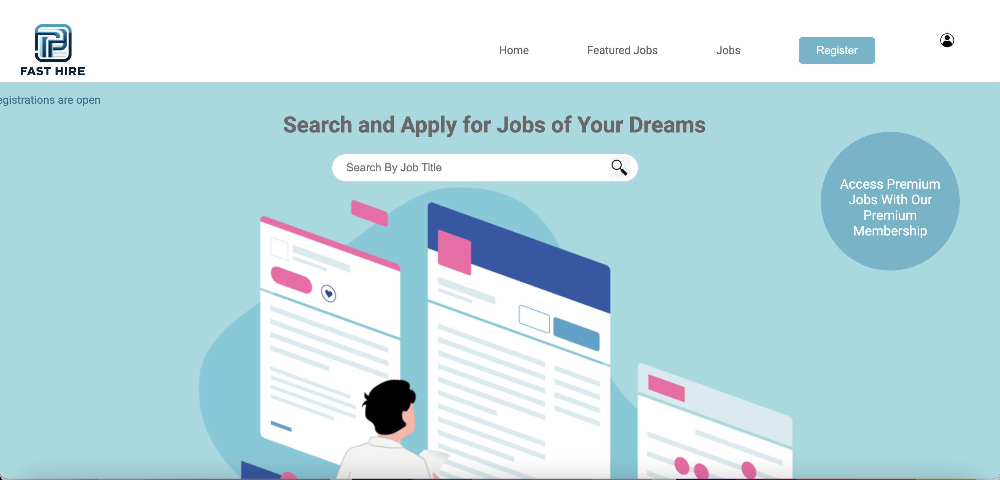

# Fast Hire: A Job Search Portal

As part of skill based assesment,I completed a project that involved creating a basic job search portal titled FastHire using HTML, CSS. This project is designed to showcase my skills in HTML and CSS.It is a static website that allows users to register, login, search and apply for jobs.I used HTML and CSS to design and style the interface.I also gained experience working with version control tools such as Git and GitHub.

## Tech-Stack-

 

## Features-

### HTML Requirements Covered

Have at least three pages.[index, login, register, jobs, featured, apply]
Keep the grid system consistent between pages as much as possible.
Use at least ten different HTML tags.[header, nav, ul, li, div, img, a, button, h1, input, table, thead, caption, th, tr, td, form, label etc.]
Include at least one table.[2 tables used on jobs.html,login.html]
Include at least two forms.[2 forms used on register.html and login.html]
Include at least one dropdown menu.[Dropdown menu used on register.html]
Include at least one of each of the following forms of content:
Text.[include in almost all of the pages]
Images.[ included]
GIFs.[ included on index.html]

### CSS Requirements

Make use of inline, internal, and external styling. [ included]
Use five different CSS selectors. [class selector, id selector, Descendant combinator, pseudo classes, child combinator on apply.html internal styling]
Use colors that complement each other.[used color theme]
Use Flexbox and/or the Bootstrap Grid.[Used flexbox for styling]
Use at least two CSS animations.[ included 2 css animations on index.html]

## Live Demo

[Fast-hire] (https://fast-hire.netlify.app/)

## Screenshots

